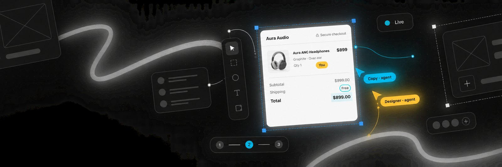
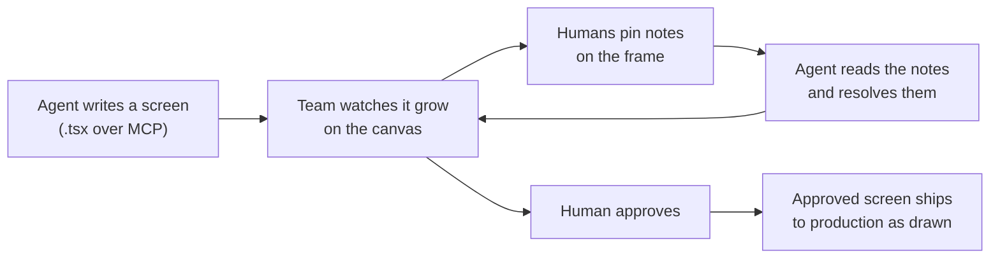

<p align="center">
  <a href="https://croqui.dev">
    <picture>
      <source media="(prefers-color-scheme: dark)" srcset="./assets/mark-white.svg">
      
    </picture>
  </a>
</p>

<h1 align="center">Croqui.dev MCP server</h1>

<p align="center">
  <strong>Croqui.dev — a collaborative design canvas where AI agents write real React screens over MCP.</strong>
</p>

<p align="center">
  <a href="https://croqui.dev"></a>
  <a href="https://croqui.dev/docs"></a>
  <a href="./server.json"></a>
  
  
</p>

<p align="center">
  <a href="#connect">Connect</a> ·
  <a href="#what-the-agent-gets">Tools</a> ·
  <a href="#skills">Skills</a> ·
  <a href="#the-build-contract">Build contract</a> ·
  <a href="./examples/first-screen.md">Example session</a> ·
  <a href="https://croqui.dev/docs">Docs</a>
</p>

<p align="center">
  <a href="https://croqui.dev"></a>
</p>

Croqui.dev is a collaborative design canvas where AI agents write real React screens over MCP,
humans annotate and approve, and the approved screen ships to production exactly as drawn.

Every frame on the canvas is a `.tsx` file that reuses the project's own design system, so the screen
your team approves is the screen engineering receives — there is no redraw step between design and
code.

Croqui.dev ships no model of its own. You connect the agent you already run: Claude Code, Codex,
Cursor or any other MCP client, all through one endpoint.

```text
https://croqui.dev/mcp
```

## How it works



| | |
| --- | --- |
| **Real screens** | Frames are React files composing your design system, not pictures of a UI. |
| **Live** | Agent writes show up as a cursor and selection boxes on the frame, region by region. |
| **Annotations as data** | A note on a frame reaches the agent as a tool result, not a new prompt someone has to write. |
| **Clickable** | Present mode walks the flow: buttons, tabs and drawers work, links between screens navigate. |
| **Approval gate** | Nothing reaches production because an agent decided it was finished. A human approves. |

## Connect

### Claude Code — plugin (recommended)

Installs the MCP server and the [skills](#skills) that teach the agent how to work on the canvas.

```bash
claude plugin marketplace add croqui-dev/croqui-mcp
claude plugin install croqui@croqui
```

Then run `/mcp`, choose **croqui** and pick **Authenticate**. A browser window opens; approve it and
go back to the terminal.

<details>
<summary><strong>Claude Code — MCP server only</strong></summary>

```bash
claude mcp add --transport http croqui https://croqui.dev/mcp
```

Authenticate the same way through `/mcp`.

</details>

<details>
<summary><strong>Codex</strong></summary>

```bash
codex mcp add croqui --url https://croqui.dev/mcp
codex mcp list
```

Authorization happens in the browser the first time a tool is called. To install the skills, use the
[Advanced setup](#advanced-setup-any-agent) prompt below — it fetches the current skill list from the
server instead of copying folders by hand.

</details>

<details>
<summary><strong>Cursor</strong></summary>

This repository is also a Cursor plugin ([`.cursor-plugin/`](./.cursor-plugin)) with the same MCP
server and skills. To add only the server, use the JSON below in your MCP settings.

```json
{
  "mcpServers": {
    "croqui": {
      "url": "https://croqui.dev/mcp"
    }
  }
}
```

</details>

<details>
<summary><strong>Any other MCP client</strong></summary>

Point the client at `https://croqui.dev/mcp` with the streamable HTTP transport. OAuth starts on the
first call.

```json
{
  "mcpServers": {
    "croqui": {
      "url": "https://croqui.dev/mcp"
    }
  }
}
```

</details>

### Advanced setup (any agent)

For any coding agent — Claude Code, Codex, Cursor, Gemini CLI, or another MCP-capable client — paste
this prompt in:

```text
https://croqui.dev/agent-setup.md
```

The agent fetches the current skill list from `https://croqui.dev/skills.json` and installs each one,
in addition to adding the MCP server. This is the fastest way to get the full skill set on a client
that doesn't have a dedicated plugin format, and it always matches what the server currently ships —
no manual copying, no stale local skills.

### Give the agent a role

With the plugin, set `CROQUI_AGENT_ROLE` when you start Claude Code:

```bash
CROQUI_AGENT_ROLE=Designer claude
```

With the MCP server only, put the role on the URL:

```bash
claude mcp add --transport http croqui "https://croqui.dev/mcp?as=Designer"
```

Encode spaces (`Copy%20writer`). The role becomes the agent's label and color next to its cursor on the canvas, so a team running
several agents can tell the copywriter from the designer at a glance.

## What the agent gets

| Area | Tool | What it does |
| --- | --- | --- |
| Account | `croqui_status` | Who the agent is signed in as, its teams, plans and write permissions |
| Projects | `croqui_open` | Viewer URL, MCP endpoint and the projects this account can see |
| | `croqui_list_projects` | List the projects the caller can see |
| | `croqui_create_project` | Create a project in one of the caller's teams |
| Read | `croqui_context` | Screens, components (shared or exclusive), references, open annotations, review stage |
| | `croqui_ds_reference` | Screen format, build contract and the project's design system components |
| | `croqui_list_files` | List the screens, components and references in a project |
| | `croqui_search` | Search across the project's files |
| | `croqui_read_file` | Read one file |
| | `croqui_history` | Revision history of a file |
| | `croqui_events` | Project event log |
| Write | `croqui_write_file` | Create or rewrite a screen or component; returns the compile result |
| | `croqui_edit_file` | Replace one snippet in a file; returns the compile result |
| | `croqui_delete_file` | Delete a file |
| Check | `croqui_inspect_screen` | A screen's structure as text: hierarchy, classes and copy |
| | `croqui_screenshot` | Render a screen on the server and return the image |
| Review | `croqui_read_annotations` | Read the pins and notes: open by default, `status`/`mine` for the corpus of how someone reviews |
| | `croqui_resolve_annotation` | Mark an annotation in progress or done, with a reply |
| | `croqui_mark_for_edit` | Pin a note on a screen for a human to review |
| | `croqui_write_presets` | Save the signed-in user's own taste presets, after they approve them |
| Import | `croqui_import_design` | The protocol for importing an existing design |

A well-behaved agent calls `croqui_context` and `croqui_ds_reference` before writing anything. That
is the difference between a screen that could belong to any company and a screen that belongs to
yours.

## Skills

The plugin ships six skills in the [Agent Skills](https://agentskills.io) format, so any client that
reads `SKILL.md` folders can use them.

| Skill | Use it to |
| --- | --- |
| [`croqui-canvas`](./skills/croqui-canvas/SKILL.md) | Build and edit screens: read context and design system, then build section by section while the team watches live |
| [`croqui-notes`](./skills/croqui-notes/SKILL.md) | Resolve the open annotations on a project, each with a reply on the note |
| [`croqui-import`](./skills/croqui-import/SKILL.md) | Bring screenshots or an existing app into a project as faithful React screens |
| [`croqui-sync`](./skills/croqui-sync/SKILL.md) | Check a sync job's design screens against production code and report with evidence |
| [`croqui-publish-bundle`](./skills/croqui-publish-bundle/SKILL.md) | Publish the product's local `ds-bundle/` to its project, so screens render with the real components and tokens |
| [`croqui-taste`](./skills/croqui-taste/SKILL.md) | Distill the notes you keep repeating into personal presets you drop onto a mark instead of retyping |

## The build contract

Screens are built so the people watching the canvas can follow along and engineering can ship the
result:

1. **Layout in flow.** Flex and grid, never coordinates placed element by element.
2. **Components first.** The design system, then the project's `components/`, then something new.
   Anything that repeats, even inside one screen, is a component.
3. **Live, in cycles.** A skeleton first, then one region at a time wired in as soon as its component
   exists, so the screen is assembled on the canvas. No local renders or drafts uploaded at the end.
4. **Interactive.** Real buttons and links with hover and focus, working tabs and toggles.
5. **Wired for Present.** `data-croqui-goto`, `data-croqui-open`, `data-croqui-close` and
   `data-croqui-back` make the click-through work in presentation mode.
6. **Verified.** `compile` on every write, and one `croqui_screenshot` after the last pass.

The full text lives in [`skills/croqui-canvas`](./skills/croqui-canvas/SKILL.md) and is served to
every agent by `croqui_ds_reference`.

## Concepts

- **Project** — holds screens, components and references, and has its own design system.
- **Screen** — one frame on the canvas: a `.tsx` file rendered at desktop and mobile viewports.
- **Component** — a reusable piece the screens compose; a component used by more than one screen is
  *shared*.
- **Annotation** — a human pin on a frame. Agents read them as tools and resolve them.
- **Present** — presentation mode: the screens as a clickable flow.
- **Approval** — a human decision per screen; an approved screen is delivered to whoever implements it.

Full explanations at <https://croqui.dev/docs>.

## FAQ

**Is there a limit on MCP calls?**
No. MCP calls are unlimited on every plan, including the free one. Plans change seats, projects,
screens and team features, not how much your agent is allowed to work.

**Can I self-host the server?**
No. The Croqui.dev MCP server is hosted and closed source; there is nothing to install beyond the
client configuration. This repository holds the connection docs, the plugin, the skills and
`server.json`, the entry published to the official MCP registry.

**Which agents work?**
Any MCP client with the streamable HTTP transport. Claude Code, Codex and Cursor are the ones the
docs and skills are written against.

**Where do I report a problem connecting an agent?**
Open an issue here.

## About the name

Croqui.dev is a product, not the Portuguese word "croqui" (a quick sketch). The name comes from the
sketch a designer scribbles fast.

<p align="center">
  <a href="https://croqui.dev">croqui.dev</a> ·
  <a href="https://croqui.dev/about">About</a> ·
  <a href="https://croqui.dev/docs">Docs</a> ·
  <a href="https://croqui.dev/llms.txt">llms.txt</a>
</p>

## For contributors

The [`skills/`](./skills) folder is generated. It's produced from the Croqui.dev server source (the
private `croqui` repo, `packages/core/src/agent-guides.ts`) by `scripts/gen-plugin.mjs`, which also
writes `.claude-plugin/plugin.json`, `.cursor-plugin/plugin.json` and the version in `server.json`.
Don't hand-edit files under `skills/` — changes will be overwritten the next time that script runs.
Fixes to skill content belong in the source repo.
